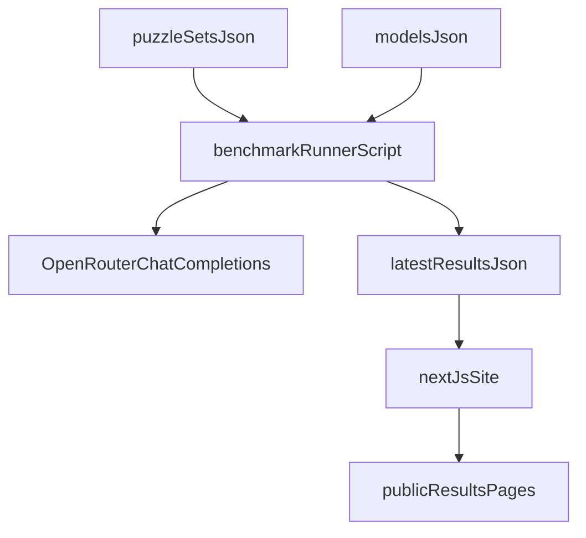

# Chessbench: snapshot benchmark MVP plan

## Goal

Publish a simple, credible chess-LLM benchmark site that shows **the latest benchmark run only** (no historical DB), across **mate-in-1/2/3** puzzle sets. You (the owner) run benchmarks via a script, commit/update a results snapshot, and deploy.

## Current repo observations (grounding)

- App is a standard **Next.js App Router** skeleton (`/Users/hardikvora/Desktop/projects/chessbench/app/layout.tsx`, `/Users/hardikvora/Desktop/projects/chessbench/app/page.tsx`).
- Tooling is **Bun** (`/Users/hardikvora/Desktop/projects/chessbench/package.json` scripts use `bun --bun next ...`).
- No backend/DB present today; good fit for a “snapshot publishing” workflow.

## Key product decisions (locked in from your answers)

- **Correctness metric**: **exact UCI match** (model must output the exact best move for mate-in-1; exact line for mate-in-2/3).
- **Publishing**: you run tests privately; users only view results.
- **Persistence**: keep only the latest snapshot in the deployed app (optionally with a run timestamp + git commit SHA).
- **Puzzle scale (MVP)**: **10 puzzles each** for mate-in-1, mate-in-2, mate-in-3.
- **Board UX**: use **`chessground`** for a lichess-like board + arrows.
- **Puzzle viewing**: show **one selected model at a time** (clean overlay): model arrow vs correct arrow.

## Architecture (simple and scalable)

- **`puzzleSetsJson`**: curated puzzles (FEN + expected UCI solution line + metadata).
- **`modelsJson`**: the list of OpenRouter model IDs you want to benchmark.
- **`benchmarkRunnerScript`**: a Bun script you run locally that:
  - builds prompts
  - calls OpenRouter
  - parses the model’s answer into UCI (strict)
  - computes scores
  - writes `latestResultsJson`
- **`nextJsSite`**: reads the snapshot and renders leaderboards + puzzle viewers.

## Data model (MVP)

- **Puzzle**
  - `id`, `level` (mate1/mate2/mate3)
  - `fen`
  - `sideToMove`
  - `solutionUciLine` (e.g. `"h5h7"` or `"g6g7 e8g8 g7g8"`)
  - optional: `source`, `tags`

- **Run snapshot (`latest.json`)**
  - `runId`, `runAt`, `promptVersion`
  - list of `models` with per-level score breakdown
  - per-puzzle details for audit + UI:
    - `rawOutput`
    - `parsedUciLine`
    - `isCorrect`

## Prompting + parsing strategy (critical for reliability)

- **Single instruction**: model must output only UCI moves.
- **Strict output schema**:
  - Mate-in-1: exactly one UCI move (`^[a-h][1-8][a-h][1-8][qrbn]?$`)
  - Mate-in-2/3: space-separated UCI line with 2 or 3 plies respectively.
- **Defense against “chatty” output**: accept only the first valid UCI token/line, otherwise mark incorrect.
- **Determinism**: temperature 0 (or as close as provider allows via OpenRouter).

## UI strategy (lichess-like puzzle pages)

### Puzzle viewer requirements

- Render the **FEN** with a smooth board.
- Show:
  - the **correct move/line** (arrow)
  - the **selected model’s move/line** (arrow)
  - the model’s **raw text** and **parsed UCI**
- For mate-in-2/3, allow stepping through plies (Next/Prev) so arrows reflect the current ply.

### Chosen implementation

- Use **`chessground`** to render the board and arrows (closest to lichess feel).
- Use a small utility (typically `chess.js`) to:
  - validate UCI format locally for UI
  - apply moves ply-by-ply to advance the displayed position

## Execution steps (incremental build)

### 1) Define puzzle sets

- Create curated sets: **10 puzzles each** for mate-in-1, mate-in-2, mate-in-3 in versioned JSON files.

### 2) Add model registry

- Maintain a `models.json` list of OpenRouter model IDs (OpenAI, Anthropic, Gemini, open-source) and display names.
- When a new model arrives: add one line to `models.json` and rerun.

### 3) Implement the benchmark runner (Bun script)

- Add a CLI script (e.g. `bun run bench`) that:
  - loads puzzles + models
  - runs each (model × puzzle) with concurrency limits
  - captures raw completion text
  - parses UCI
  - computes correctness
  - writes `public/results/latest.json`

### 4) Build the results UI (leaderboard + puzzle pages)

- Replace the starter homepage with:
  - overview (run date, #models, #puzzles)
  - leaderboard table (overall + per level)
- Add a per-model and/or per-level drilldown that lists puzzles.
- Add a **puzzle detail view** that uses **`chessground`**:
  - select model (dropdown)
  - render board from FEN
  - draw **model arrow** and **correct arrow**
  - show model output + parsed UCI

### 5) Deployment workflow

- Commit `public/results/latest.json` and deploy normally (Vercel is fine).
- Update cycle:
  1. run `bun run bench`
  2. verify results locally
  3. commit snapshot
  4. deploy

## Security + cost controls

- Keep `OPENROUTER_API_KEY` only in your local env/CI secrets.
- The deployed site should never expose the API key (no public “run benchmark” route).
- Add rate limiting/concurrency in the runner to avoid accidental cost spikes.

## Scope boundaries (to keep it “simple”)

- No user accounts.
- No server-side job queue.
- No DB.
- No engine verification in v1 (since you chose exact-match).

## Minimal file touch list (where changes would go once you approve execution)

- Runner + data:
  - `/Users/hardikvora/Desktop/projects/chessbench/bench/models.json`
  - `/Users/hardikvora/Desktop/projects/chessbench/bench/puzzles.mate1.json`
  - `/Users/hardikvora/Desktop/projects/chessbench/bench/puzzles.mate2.json`
  - `/Users/hardikvora/Desktop/projects/chessbench/bench/puzzles.mate3.json`
  - `/Users/hardikvora/Desktop/projects/chessbench/bench/run.ts`
  - `/Users/hardikvora/Desktop/projects/chessbench/public/results/latest.json` (generated)
- UI:
  - `/Users/hardikvora/Desktop/projects/chessbench/app/page.tsx`
  - `/Users/hardikvora/Desktop/projects/chessbench/app/puzzles/[puzzleId]/page.tsx` (chessground viewer)
  - `/Users/hardikvora/Desktop/projects/chessbench/app/models/[modelId]/page.tsx` (model drilldown)
  - `/Users/hardikvora/Desktop/projects/chessbench/app/components/ChessgroundBoard.tsx` (client component wrapper)
  - `/Users/hardikvora/Desktop/projects/chessbench/app/components/ModelSelector.tsx`
  - `/Users/hardikvora/Desktop/projects/chessbench/app/lib/chess.ts` (UCI helpers + move application)
- Docs:
  - `/Users/hardikvora/Desktop/projects/chessbench/README.md`

## Implementation todos

- **define-puzzle-format**: Add benchmark puzzle JSON format and initial curated 10-puzzle sets for mate-in-1/2/3 under `bench/`.
- **model-registry**: Create a `bench/models.json` registry for OpenRouter model IDs and display names.
- **runner-openrouter**: Implement a Bun benchmark runner that calls OpenRouter, enforces strict UCI output parsing, scores puzzles, and writes `public/results/latest.json`.
- **results-ui**: Build leaderboard + model drilldowns + puzzle detail pages, using `chessground` for a lichess-like board with arrows for the selected model move vs the correct move.
- **deploy-workflow-docs**: Document the owner-only benchmark + publish workflow in README (env vars, commands, update steps, and how to add a new model).

